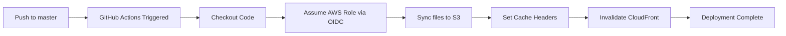

# S3 CI/CD Setup Guide

## Overview
This guide will help you set up automatic deployment of your frontend to S3 whenever you push changes to the `master` branch.

## Prerequisites

✅ AWS Account with permissions to create IAM roles
✅ GitHub repository with admin access
✅ S3 bucket already created (from CloudFormation template 07-dashboard.yaml)

---

## Step 1: Deploy GitHub OIDC Provider (One-Time Setup)

If you haven't already deployed the OIDC provider, run this command:

```bash
# Set your values
GITHUB_ORG="JosianQuintanaArroyoKaizen"
GITHUB_REPO="AI_SOC"
AWS_REGION="us-east-1"  # Change to your region

# Deploy the OIDC stack
aws cloudformation deploy \
  --template-file cloudformation/00-github-oidc.yaml \
  --stack-name github-oidc-provider \
  --parameter-overrides \
    GitHubOrg=$GITHUB_ORG \
    GitHubRepo=$GITHUB_REPO \
  --capabilities CAPABILITY_NAMED_IAM \
  --region $AWS_REGION

# Get the role ARN (you'll need this)
aws cloudformation describe-stacks \
  --stack-name github-oidc-provider \
  --query 'Stacks[0].Outputs[?OutputKey==`RoleArn`].OutputValue' \
  --output text \
  --region $AWS_REGION
```

---

## Step 2: Configure GitHub Secrets

Go to your GitHub repository:
`Settings` → `Secrets and variables` → `Actions`

Add these **Repository Secrets**:

| Secret Name | Value | Example |
|------------|-------|---------|
| `AWS_ACCOUNT_ID` | Your AWS Account ID | `194561596031` |

### Optional: Add Repository Variables

If you're using CloudFront, add this **Repository Variable**:

| Variable Name | Value |
|--------------|-------|
| `CLOUDFRONT_DISTRIBUTION_ID` | Your CloudFront distribution ID (if using) |

---

## Step 3: Update S3 Bucket Name in Workflow

Edit `.github/workflows/deploy-s3-frontend.yml` and update:

```yaml
env:
  AWS_REGION: us-east-1  # Your AWS region
  S3_BUCKET: ai-soc-dev-dashboard-194561596031  # Your actual S3 bucket name
```

To find your S3 bucket name:

```bash
# Get the S3 bucket name from CloudFormation
aws cloudformation describe-stacks \
  --stack-name ai-soc-dev-dashboard \
  --query 'Stacks[0].Outputs[?OutputKey==`WebsiteURL`].OutputValue' \
  --output text
```

---

## Step 4: Test the Deployment

### Option A: Push a change to master

```bash
# Make sure your fix is committed
git add docs/index.html
git commit -m "Fix: Remove page reload on logo click"
git push origin master
```

The workflow will automatically trigger! 🎉

### Option B: Manual trigger

1. Go to GitHub: `Actions` → `Deploy Frontend to S3`
2. Click `Run workflow` → Select `master` branch → `Run workflow`

---

## Step 5: Monitor the Deployment

1. Go to `Actions` tab in your GitHub repository
2. Click on the running workflow
3. Watch the deployment progress in real-time

Expected output:
```
✅ S3 Bucket: ai-soc-dev-dashboard-194561596031
✅ Region: us-east-1
🌐 Website URL: http://ai-soc-dev-dashboard-194561596031.s3-website-us-east-1.amazonaws.com
```

---

## Troubleshooting

### Issue: "User is not authorized to perform: sts:AssumeRoleWithWebIdentity"

**Solution**: Make sure the GitHub OIDC stack is deployed:

```bash
aws cloudformation describe-stacks --stack-name github-oidc-provider
```

### Issue: "AccessDenied when calling S3 Sync"

**Solution**: Add S3 permissions to the GitHubActionsRole:

```bash
# Update the role to include S3 full access
aws iam attach-role-policy \
  --role-name GitHubActionsRole \
  --policy-arn arn:aws:iam::aws:policy/AmazonS3FullAccess
```

### Issue: Wrong S3 bucket name

**Solution**: Check your CloudFormation outputs:

```bash
aws cloudformation describe-stacks \
  --stack-name ai-soc-dev-dashboard \
  --query 'Stacks[0].Outputs'
```

### Issue: Files not updating in browser

**Solution**: The browser is caching. Try:
1. Hard refresh: `Ctrl+Shift+R` (Windows/Linux) or `Cmd+Shift+R` (Mac)
2. Clear browser cache
3. Add CloudFront invalidation (if using CloudFront)

---

## Deployment Flow



---

## What Gets Deployed

The workflow deploys everything in the `docs/` folder:

- ✅ `docs/index.html` → Your main landing page
- ✅ `docs/portal-landing.html`
- ✅ `docs/ai-soc/` → Documentation site
- ✅ `docs/assets/` → Images, logos, etc.
- ✅ `docs/javascripts/` → JavaScript files
- ✅ `docs/stylesheets/` → CSS files

**Cache Strategy:**
- HTML files: 5 minutes cache
- Assets (CSS/JS/images): 1 year cache

---

## Next Steps

1. ✅ Deploy OIDC stack (Step 1)
2. ✅ Add GitHub secrets (Step 2)
3. ✅ Update bucket name in workflow (Step 3)
4. ✅ Test deployment (Step 4)
5. 🎉 Enjoy automatic deployments!

---

## Security Notes

- ✅ **No AWS keys stored in GitHub** - Uses OIDC for secure authentication
- ✅ **Least privilege** - GitHubActionsRole only has necessary permissions
- ✅ **Audit trail** - All deployments logged in CloudTrail
- ✅ **Branch protection** - Only master branch can deploy

---

## Monitoring

After deployment, check:

1. **GitHub Actions logs**: Full deployment output
2. **S3 bucket**: Files should be updated
3. **CloudTrail**: AWS API calls logged
4. **Website**: Visit the S3 website URL to verify

---

## FAQ

**Q: Do I need to manually sync files anymore?**
A: No! Every push to master automatically deploys to S3.

**Q: Can I deploy to multiple environments?**
A: Yes! Create separate workflows for dev/staging/prod with different S3 buckets.

**Q: What if I only want to deploy when docs/ changes?**
A: The workflow already filters on `paths: - 'docs/**'`

**Q: How do I rollback?**
A: Use S3 versioning or git revert + push to redeploy previous version.

---

## Quick Reference Commands

```bash
# Check if OIDC stack exists
aws cloudformation describe-stacks --stack-name github-oidc-provider

# Get S3 bucket name
aws cloudformation describe-stacks --stack-name ai-soc-dev-dashboard \
  --query 'Stacks[0].Outputs[?OutputKey==`WebsiteURL`].OutputValue' --output text

# Manually trigger workflow (using GitHub CLI)
gh workflow run deploy-s3-frontend.yml

# View recent workflow runs
gh run list --workflow=deploy-s3-frontend.yml

# Watch a specific workflow run
gh run watch
```

---

**Ready to go!** Push your changes and watch the magic happen ✨
